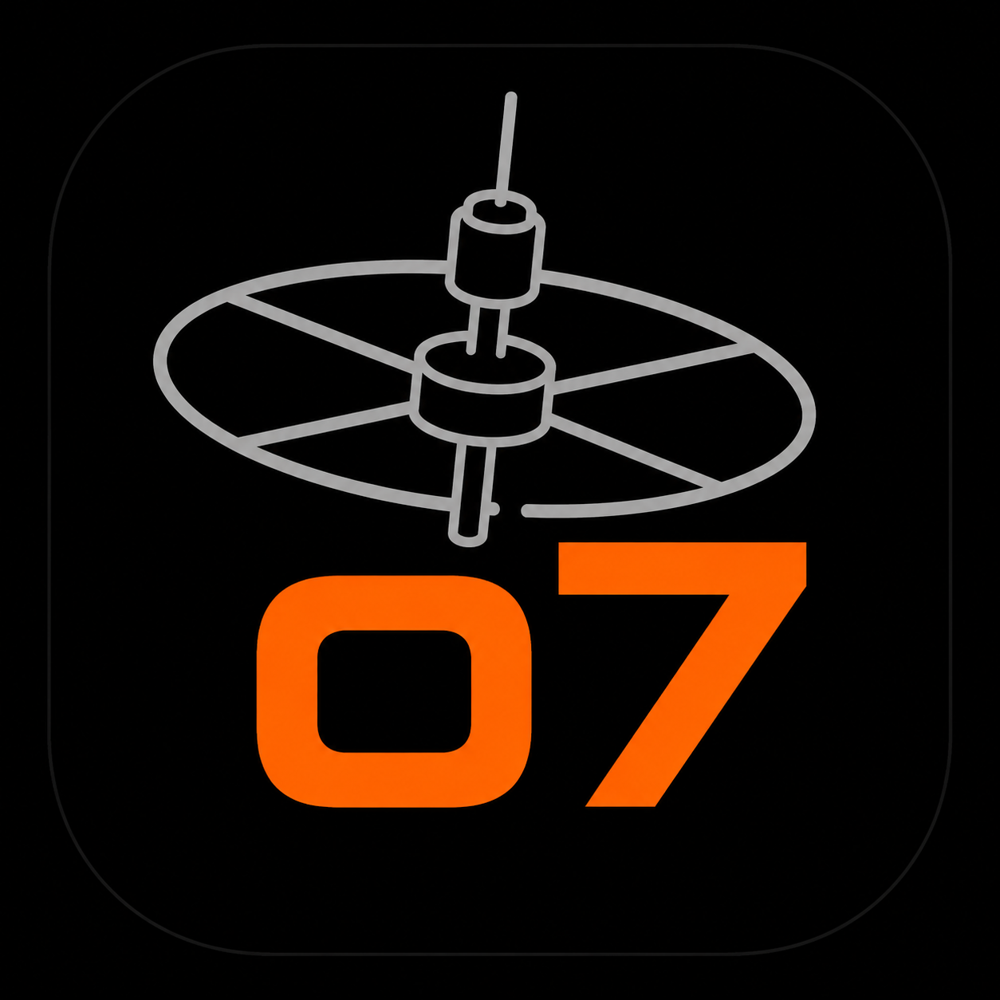

 [o7 Debrief](https://oernster.github.io/o7Debrief/)

# o7 Debrief

A local-first Windows desktop application that reads the Elite Dangerous player Journal and, at the end of a play session, produces a single self-contained Commander Mission Debrief report.

o7 Debrief watches the Journal while you play, brackets each session by its `LoadGame` and `Shutdown` events, aggregates the raw journal stream into high-level conceptual beats, and renders a debrief when the session ends or whenever you ask for one. Every figure in the report traces back to a real journal field. Nothing is estimated, inferred or padded.

## Who it is for

- Elite Dangerous PC players who want a clear after-session summary of what they actually did.
- Commanders who want to share a session writeup on Discord or Reddit without hand-typing it.
- Players who care that the numbers are real and verifiable against their own journal.

## Who it is NOT for

- This is not a live in-game overlay. It does not draw on screen while you fly.
- This is not a real-time tool. It reports after the fact, in batches, not continuously during play.

## Platform support

o7 Debrief currently supports Windows only. It is built and tested as a standalone Windows executable. macOS and Linux are not supported at this time, and a port is not planned at present.

## Capabilities

- Live system-tray watcher that follows the active Journal with a low-frequency modification-time poll (no `watchdog` dependency) and automatically generates a debrief on `Shutdown`, with a crash-timeout safety net for sessions that end without a clean shutdown.
- Cold one-shot mode: "Debrief my last session" reads the most recent session while "Debrief my history to date" covers everything you have played so far; both produce a report even if o7 Debrief was not running while you played.
- A home screen on a left-click of the tray icon: the live status, the two debrief actions and the reports generated this run, all in one place. A right-click opens the full tray menu.
- Session isolation: the latest session is the slice of the journal from the last `LoadGame` to the end of the stream, so a previous session never bleeds into the current one.
- Rank reporting that is honest about journal timing: tier-ups (a `Promotion`) are reported immediately, and fractional rank percentages are finalised at the next launch because the journal only snapshots rank progress at startup. Only ranks that actually changed are shown.
- A single self-contained HTML report (inlined CSS, zero JavaScript) as the canonical output, plus a Markdown rendering for pasting elsewhere. A default export format is configurable and can be overridden per export.
- A configuration-driven event taxonomy held in TOML, so the mapping from raw events to conceptual beats has no magic numbers buried in code.

## Stack

| Concern | Choice |
| --- | --- |
| Language | Python 3.13 |
| Desktop UI | PySide6 (system tray and minimal windows) |
| Report templating | Jinja2 (HTML) |
| Configuration | stdlib `tomllib` (TOML taxonomy) |
| Testing | pytest with pytest-cov (100% gate on domain and application) |
| Packaging | Nuitka (standalone Windows executable) |
| Licence | LGPL-3.0 |

## Install and run

o7 Debrief ships as a standalone Windows executable produced by the build below; an installer is also provided. For end users there is no Python install to manage: run the installer, then start o7 Debrief from the Start menu. It places an icon in the system tray and watches the Journal from there.

To run from source during development, see [DEVELOPMENT-README.md](DEVELOPMENT-README.md).

## Test

The project enforces 100% line and branch coverage on the domain and application layers.

```pytest -v --cov```

See [TESTING.md](TESTING.md) for the full strategy.

## Build

```powershell
python buildexe.py        # Nuitka standalone executable, console disabled
python buildinstaller.py  # Windows installer
```

Build prerequisites and the development workflow are described in [DEVELOPMENT-README.md](DEVELOPMENT-README.md).

## Architecture

o7 Debrief follows a clean architecture with a strict dependency direction and a deterministic core. The two capture paths (live tray watcher and cold one-shot) share one reducer, so a debrief is reproducible from the same journal bytes regardless of how it was triggered. The full set of invariants, the layer breakdown, the execution flow and the design-decision rationale are in [ARCHITECTURE.md](ARCHITECTURE.md).

## Licence

o7 Debrief is released under the GNU Lesser General Public License v3.0 (LGPL-3.0). See [LICENSE](LICENSE) for the full text.
