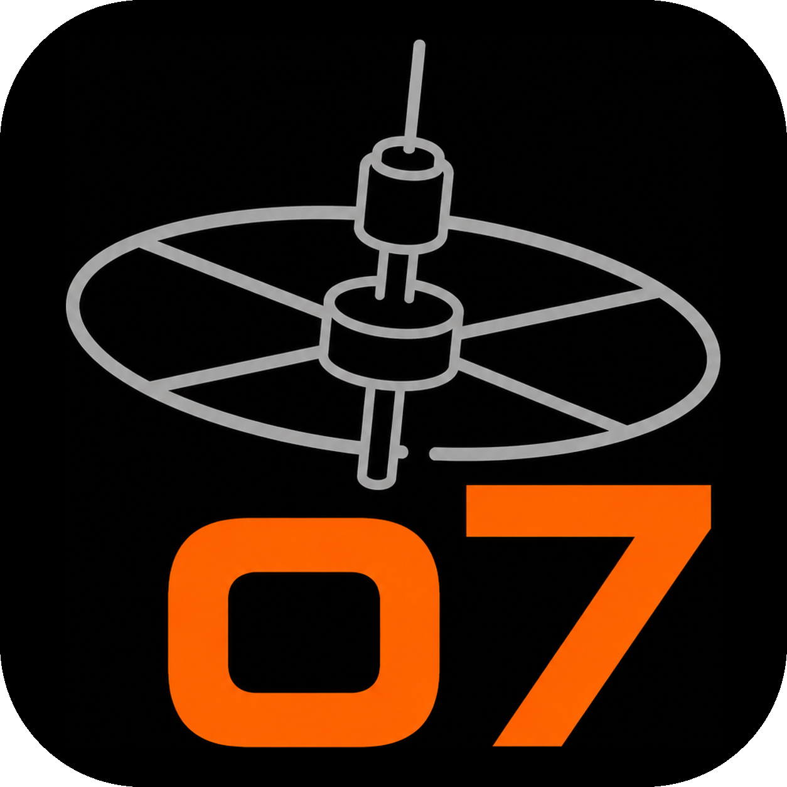

 [o7 Debrief](https://ernster.dev/o7Debrief/)

# o7 Debrief

A local-first desktop application that reads the Elite Dangerous player Journal and produces a Commander Mission Debrief report at the end of a play session.

o7 Debrief watches the Journal while you play, brackets each session by its `Shutdown` events, aggregates the raw journal stream into high-level moments and renders a debrief when the session ends or whenever you ask for one. Every figure in the report traces back to a real journal field. Nothing is estimated, inferred or padded. A figure the journal never stated is reported as unread rather than as zero.

## Who it is for

- Elite Dangerous PC players who want a clear after-session summary of what they actually did.
- Commanders who want to share a session writeup on Discord or Reddit without hand-typing it.
- Players who care that the numbers are real and verifiable against their own journal.

## Who it is NOT for

- This is not a live in-game overlay. It does not draw on screen while you fly.
- This is not a real-time tool. It reports after the fact, in batches, not continuously during play.

## Platform support

o7 Debrief runs on Windows as a standalone executable. That is the platform every release is built and tested on.

**Linux ships as a Flatpak, with one part of it still unproven.** Each release publishes `o7debrief.flatpak` alongside the Windows setup program and the Flatpak has been built, installed and run on Ubuntu. What has not been proven is the part that matters most: no debrief has yet been generated on Linux from a real journal inside a Proton prefix and no report has been opened in a host browser from inside the sandbox. Both need a machine with the game installed rather than another build. So the Linux bundle is real and installable rather than theoretical, while the end-to-end path a player actually walks is described below as intended behaviour; [TECH_DEBT.md](TECH_DEBT.md) item 4 records exactly what has and has not been verified.

On Linux the game itself runs under Proton or Wine, so the journal sits inside the game's prefix. o7 Debrief finds it without being told: it looks through the Steam compatdata prefixes (including Steam installed as a Flatpak), honours `STEAM_COMPAT_DATA_PATH` and `WINEPREFIX`, then falls back to a plain `~/.wine` prefix, trying both the `steamuser` and the real user name at each.

Tick "start o7 Debrief in the background when I sign in" and o7 Debrief watches from session start, so quitting the game opens the debrief in your browser exactly as it does on Windows. On Linux that setting writes an XDG autostart entry rather than a registry value; everything else behaves the same.

Not every Linux desktop draws a system tray, so o7 Debrief does not assume one. A stock GNOME session draws none, Ubuntu ships an extension that does, KDE, XFCE, MATE, Cinnamon and LXQt each provide one their own way, and any of them can have it switched off. Rather than guess from the distribution, o7 Debrief asks your desktop what it actually provides, and it asks for a few seconds rather than once: started at sign-in the app is up before the panel that would host the icon has finished loading, and asking too early would report no tray on a session that is about to have one.

Where there is a tray, you get the icon. Where there is not, o7 Debrief opens its home screen instead, so it is never left running with nothing on screen to click. Closing that window leaves it running and watching the journal.

Either way, launching o7 Debrief again is always the route back to it: the second launch hands the request to the copy already running and closes, then that copy opens its home screen, which carries everything the tray menu does. So the desktop entry in your applications menu summons the window, and nothing about the app is out of reach on a desktop with no tray. Launching again on Windows does the same thing rather than appearing to do nothing.

macOS is not supported.

## Capabilities

- Live background watcher that follows the active Journal with a low-frequency modification-time poll (no `watchdog` dependency) and automatically generates a debrief on `Shutdown`, with a crash-timeout safety net for sessions that end without a clean shutdown.
- Cold one-shot mode: "Debrief my last session" reads the most recent session while "Debrief my history to date" covers everything you have played so far; both produce a report even if o7 Debrief was not running while you played.
- A history report that stays readable as it grows. Years of play would make one HTML document too large to open, so the history debrief is written as a small static bundle instead: an index carrying the report and the newest month of the log, one page per calendar month beneath it and a single shared stylesheet. It opens from your own filesystem with no server and no scripts. The index lists every month in the history, so any of them is one click away rather than a walk through the pages in between; each page carries newer and older links and one back to that list. It is regenerated every time you quit the game and only the pages whose contents actually changed are rewritten, so a four-minute session rewrites the index and the stylesheet and leaves every older page alone.
- Light on resources: o7 Debrief reads only the events each debrief needs rather than the whole journal, so it stays small and quiet in the background no matter how many years of logs you have. A last-session debrief reads back only as far as the previous session; the all-history report streams the journal file by file; the live watcher keeps only the session in progress.
- A home screen on a left-click of the tray icon: the live status, the two debrief actions and the reports generated this run, all in one place. A right-click opens the full tray menu. On a desktop that draws no tray the home screen opens by itself, and launching o7 Debrief while it is already running opens that same home screen instead of starting a second copy, so the app is reachable whether or not there is a tray to put an icon in.
- Session isolation: the latest session is the run bounded by `Shutdown` events (the run ending at the last `Shutdown`), with every `LoadGame` inside it kept, so a previous session never bleeds into the current one.
- Rank reporting that is honest about journal timing: tier-ups (a `Promotion`) are reported immediately and fractional rank percentages are finalised at the next launch because the journal only snapshots rank progress at startup. Only ranks that actually changed are shown.
- A single self-contained HTML report (inlined CSS, zero JavaScript) as the canonical output for a session, plus a Markdown rendering for pasting elsewhere. A default export format is configurable and can be overridden per export. The whole-history report is the one exception and is written as a bundle, for the reason above; a `single_file` setting in the taxonomy emits it as one document instead, capped at a configurable number of log entries with the footer stating how many were left out.
- A configuration-driven event taxonomy held in TOML, so the mapping from raw events to moments has no magic numbers buried in code.
- Ship-launched vessel coverage (the Nomad SLV): the debrief tracks deploying, docking and losing the vessel as its own control context alongside ship, SRV and on-foot, naming the vessel type on each row. It also counts Vessel Hangar modules bought, sold or traded in. The vessel is its own domain section, so a surface-exploration session in the Nomad reads clearly.
- Ship-launched fighter coverage: deploying, docking and losing a fighter (the F63 Condor, GU-97, Taipan and the Guardian Trident, Javelin and Lance, in any loadout variant) each appear as their own row in a dedicated fighter context, named from the journal loadout. Flying a fighter yourself is its own control context; an NPC-crewed fighter leaves you in the ship.
- Clearer session log: each row shows the activity it records (a trade, a bounty, a scan) rather than which control mode you were in. The log is ordered most recent first, so the latest thing you did sits at the top.
- Dates where they are needed and nowhere else. A log covering more than one day heads each day with its date, so a history report reading 15:15:30 above 11:48:26 is plainly two different days rather than a broken sort. A single session shows no dates at all and keeps the narrow time column. A session that crosses midnight gets them. The grouping is worked out for each panel separately, so a category holding one afternoon's rows stays undated even when the full log spans months. Every time in the report is the journal's own UTC, shown unconverted and labelled as such in the footer, which is also why a daylight-saving change cannot file a row under the wrong day.
- A session log that says what you actually did. Every row states the specifics the journal recorded rather than repeating the name of its kind: an engineering roll names the blueprint, the grade, the module and the engineer who applied it, so an evening of two hundred rolls reads as the work it was instead of two hundred identical lines. The wording of each row lives in the TOML taxonomy beside the rule that produces it, so changing how something reads is a config edit. A row whose journal entry lacks a field the wording needs falls back to naming its kind, because a sentence with a gap in it would read as a fact.
- Names in English, not in the journal's code. The journal calls a module `int_sensors_size5_class2` and never states a readable name for one, so o7 Debrief decodes the token and reports a 5D Sensors, a Medium Gimballed Multi-Cannon, a Long Range Sensor blueprint. The decode is structural and its vocabulary is in the taxonomy: every word shown is a part of the token, a substitution the config names or a rating letter from the config's own table. A part the vocabulary does not cover is kept and title-cased rather than dropped, so an unrecognised module still reads as itself and the gap is visible in the report instead of silently swallowed.
- Material trading is reported. Exchanges at the raw, manufactured and encoded material traders appear in the session log naming both sides ("Traded 90 ruthenium for 15 technetium at the raw trader") and are counted in the Trade section. They carry no credit figure because they cost no credits: you pay in materials and the journal states no price.
- Deaths that stand alone: a death row reports who destroyed you, by name, with their ship, rank and squadron where the journal records them and every attacker listed for a wing kill; a self-destruct is named as such and an environmental death reads simply as a loss. The killer's ship is named from the targeting scan that preceded the kill, so it reads "Cobra Mk V" rather than the raw model token the death event carries.
- Every death also names the victim: you, plus the vehicle you actually lost, at the moment you lost it rather than whatever you finished the session in. An SRV destroyed under you is named as the SRV, not the ship it launched from. The rebuy the resurrection charged closes the row, a real cost no other figure in the report accounts for.
- Distances that are real: the Travel section totals the light years your ship actually covered, read from the distance each jump states. The Fleet Carrier section does the same for the carrier, worked out from the positions of the systems it arrived in, since a carrier jump records where it went and never how far it came. That leaves the first jump of a session with no origin to measure from, so the report says which jumps the total covers instead of quietly under-reporting.
- A credit change that is the truth, not the takings. The headline sits your balance beside the session's real change, taken from the balances the journal states at each end, so a rebuy, an outfitting spree or a hold full of tritium counts against you exactly as it did in game. A session that ended poorer says so. Where the journal stated too few balances to measure a change, the report says the change is unread rather than showing a zero you would read as breaking even.
- Readings the journal never gave are said out loud rather than shown as zero. A rank percentage carries its last known reading forward and reports "No reading" only when nothing is known at all, then the systems figure names where you actually are because a commander is always somewhere. Spending is shown too: the Trade section totals what your purchases actually cost, since the journal states it. A count of nothing is never printed where the truth is that nothing was read.
- A Notices block that appears only when it must: if the taxonomy names a journal field an event never carried (or carried in a form the report could not read), it says so instead of quietly printing zero, naming the event and the field.
- Combat kills name the ship: a bounty row names the ship you destroyed (any type, since NPCs can fly any ship, including a ship-launched fighter), so what you killed and what killed you both identify the ship type.
- Missions and Operations name themselves: a completed mission row names the mission (an Operation carries a readable title) and its issuing faction; an Operation also surfaces the Merc Coins it paid on the row, for example "Completed Infiltrate the compound for Fong Wang Limited (+500 Merc Coins)". The Missions section totals both the credit reward and the Merc Coins separately; the Merc Coins never join a credit figure because they are a distinct currency. The Merc Coins journal field is named in the taxonomy, so a game-side change to it is a one-line config edit. If the named field is absent from an Operation the report raises a notice rather than reporting a reward of zero.
- An update check that respects you: shortly after launch and once a day while running, the app asks GitHub anonymously whether a newer published release exists, with a Check for updates button on the home screen and a tray menu entry doing the same on demand. If one is found you choose Download (your platform's installer, falling back to the releases page), Skip this version or Later; a skipped version never prompts again and a failed check is silent on the automatic paths. This anonymous ask is the only network call the app makes and nothing is ever downloaded or run without you choosing it.

## Stack

| Concern | Choice |
| --- | --- |
| Language | Python 3.13 |
| Desktop UI | PySide6 (system tray and minimal windows) |
| Report templating | Jinja2 (HTML) |
| Configuration | stdlib `tomllib` (TOML taxonomy) |
| Testing | pytest with pytest-cov (100% gate on domain, application, five infrastructure sub-packages and the setup program's operations and state) |
| Packaging | Nuitka (standalone Windows executable), Flatpak (Linux) |
| Licence | LGPL-3.0 |

## Install and run

o7 Debrief ships as a standalone Windows executable produced by the build below; a setup program is also provided. For end users there is no Python install to manage: run the setup program, then start o7 Debrief from the Start menu. It places an icon in the system tray and watches the Journal from there.

The setup program installs per-user, so it needs no administrator rights. It installs, repairs, upgrades and uninstalls, reports the phase and the progress of whatever it is doing rather than freezing behind a single line of text, offers to close a running copy of o7 Debrief for you instead of asking you to find the tray icon yourself and reads the current "start when I sign in to Windows" setting so the box you see matches what is actually set.

When o7 Debrief is already installed the window names the version you have, so an upgrade tells you what you are moving from as well as what you are moving to. If you asked it to start o7 Debrief when finished and that start does not happen, the window says so and stays open rather than closing on a launch that never occurred. Each step it takes is appended to `o7debrief-installer.log` in your temporary directory, so a setup run that goes wrong can be explained afterwards instead of guessed at.

To run from source during development, see [DEVELOPMENT-README.md](DEVELOPMENT-README.md).

## Test

The project enforces 100% line and branch coverage on the domain and application layers, on the infrastructure sub-packages that can reach it and on the setup program's operations and state model.

```powershell
pytest
echo "EXIT=$LASTEXITCODE"
```

The coverage flags live in `pyproject.toml`, so `pytest` alone applies the gate to the packages it covers. Do not add a bare `--cov`: it widens measurement to the UI and the composition roots, which are deliberately outside the gate, and the run then fails the 100% threshold on a clean tree.

See [TESTING.md](TESTING.md) for the full strategy and [TECH_DEBT.md](TECH_DEBT.md) for what is
still open, what is deliberately left and what only looks like debt.

## Build

```powershell
python buildexe.py        # Nuitka standalone executable, console disabled
python buildinstaller.py  # Windows installer
```

On Linux, from a checkout with the virtual environment created:

```bash
./build_flatpak.sh
```

It writes its own manifest, launcher, desktop entry and metainfo, derives the icon set from the single master PNG, pre-downloads the wheels on the host so the sandboxed build is offline, then installs the app and produces `o7debrief.flatpak`. `./cleanup_flatpak.sh` removes only what that script produced, leaving the Windows build outputs alone.

Build prerequisites and the development workflow are described in [DEVELOPMENT-README.md](DEVELOPMENT-README.md).

## Architecture

o7 Debrief follows a clean architecture with a strict dependency direction and a deterministic core. The two capture paths (live background watcher and cold one-shot) share one reducer, so a debrief is reproducible from the same journal bytes regardless of how it was triggered. The setup program is a second, self-contained program built to the same shape, with its side effects and its state model separated from its Qt client so the privileged work is measurable. The full set of invariants, the layer breakdown, the execution flow and the design-decision rationale are in [ARCHITECTURE.md](ARCHITECTURE.md).

## Licence

o7 Debrief is released under the GNU Lesser General Public License v3.0 (LGPL-3.0). See [LICENSE](LICENSE) for the full text.

Elite Dangerous is a trademark of Frontier Developments plc. o7 Debrief is an unofficial, fan-made tool and is not affiliated with Frontier Developments.
